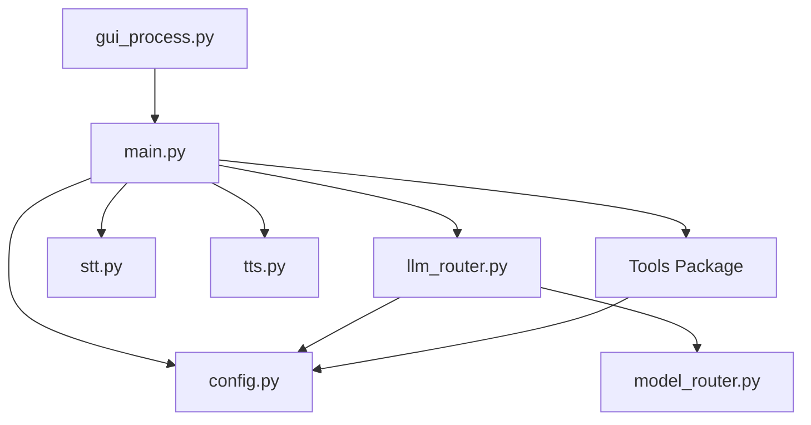

# Project Map

## File Tree

### Core System
- `main.py`: Main orchestrator, coordinates all components (Voice, LLM, Tools).
- `config.py`: Central configuration (API keys, paths, models, constants).
- `run_app.py`: Entry point for running the application.
- `llm_router.py`: Routes tasks between GPT (Action) and Gemini (Analysis).
- `model_router.py`: Logic for selecting specific LLM models based on task metadata.
- `dispatcher.py`: Handles event dispatching (if applicable, based on file presence).
- `intent_router.py`: Fast, deterministic routing for common commands.

### Voice Components
- `stt.py`: Speech-to-Text interface (Local Whisper).
- `tts.py`: Text-to-Speech interface (macOS Say).
- `wake_word.py`: Wake word detection logic.
- `gui_process.py`: Handles the GUI process.
- `simple_gui.py`: Simple GUI implementation.
- `hva_menubar.py`: Menubar application logic.

### Tools (`haitham_voice_agent/tools/`)
- `browser.py`: Browser automation (open URL, search).
- `files.py`: File system operations (list, search, create, delete).
- `system_tools.py`: System level operations (volume, brightness, apps).
- `gmail/`: Gmail integration modules.
- `memory/`: Memory management modules.
- `secretary.py`: Secretary role logic.
- `advisor.py`: Safety advisor logic.
- `smart_organizer.py`: File organization logic.

## Dependencies Graph

## Critical Files (DO NOT modify without careful review)
1.  **`config.py`**: The backbone of the system. Changing paths, keys, or model names here affects EVERY component.
    *   *Risk*: High. Can break startup, API calls, and file access.
2.  **`main.py`**: The central nervous system. Controls the main loop, mode switching (Command vs Session), and error handling.
    *   *Risk*: High. Can cause the agent to hang, crash, or misinterpret commands.
3.  **`llm_router.py`**: Decides which brain (GPT vs Gemini) handles a request.
    *   *Risk*: Medium-High. Can lead to poor performance or failed task execution if routing logic is flawed.
4.  **`intent_router.py`**: Handles fast-path commands.
    *   *Risk*: Medium. Can break basic commands like "stop" or "save note".

## Safe Files (Can be modified with low risk)
1.  **`tools/browser.py`**: Isolated functionality for opening URLs.
    *   *Risk*: Low. Only affects browser commands.
2.  **`tools/files.py`**: File operations.
    *   *Risk*: Low-Medium. Logic is self-contained.
3.  **`tools/system_tools.py`**: System control.
    *   *Risk*: Low.
4.  **`docs/*.md`**: Documentation files.
    *   *Risk*: None.

## Entry Points
1.  **`run_app.py`**: Standard entry point.
2.  **`main.py`**: Can be run directly for testing core logic.
3.  **`Start HVA.command`**: Shell script for easy launching.

---
## UPDATE LOG
| Date | Change | Verified By | Test Result |
|------|--------|-------------|-------------|
| 2025-12-01 | Initial creation | Antigravity | Pass |
